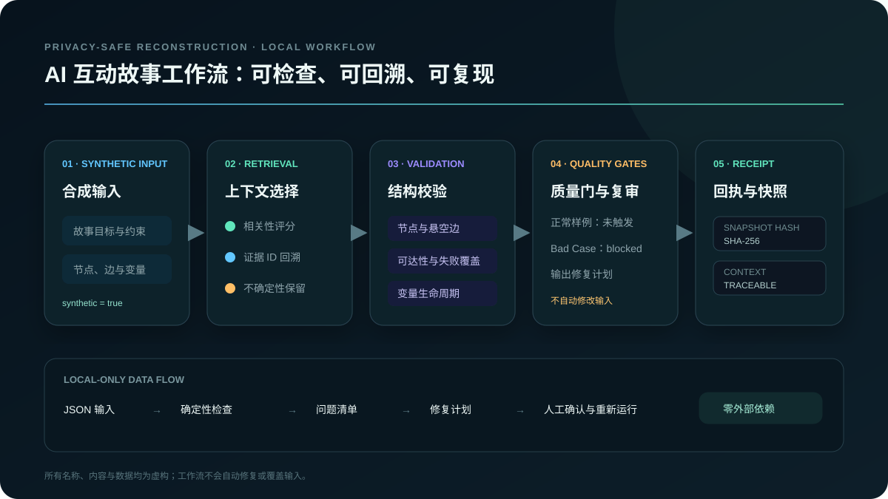
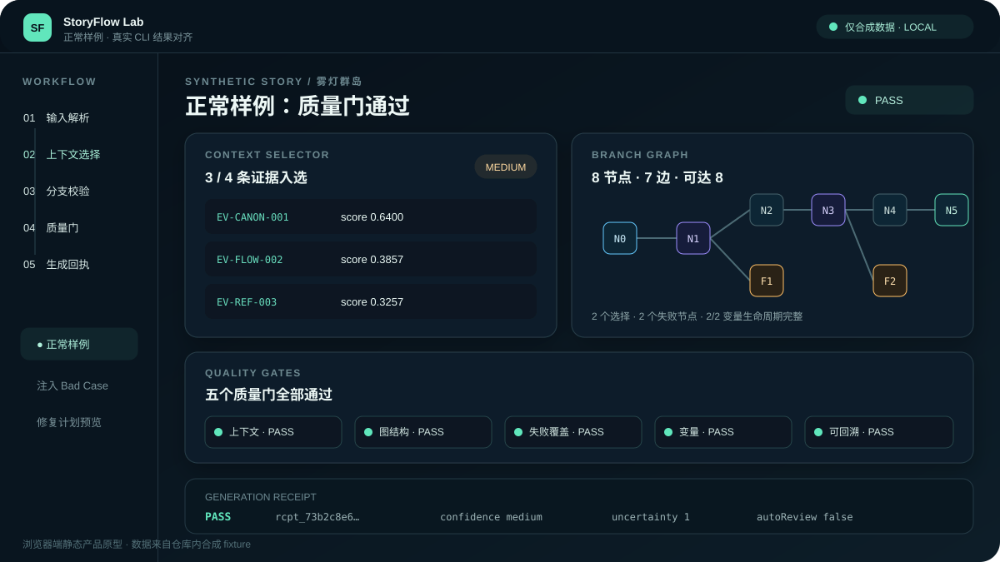
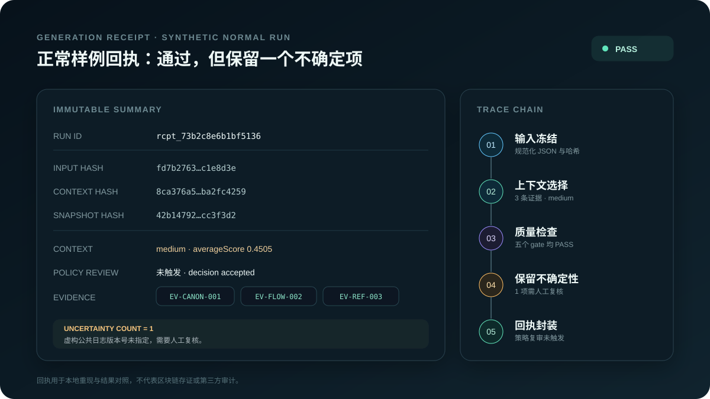
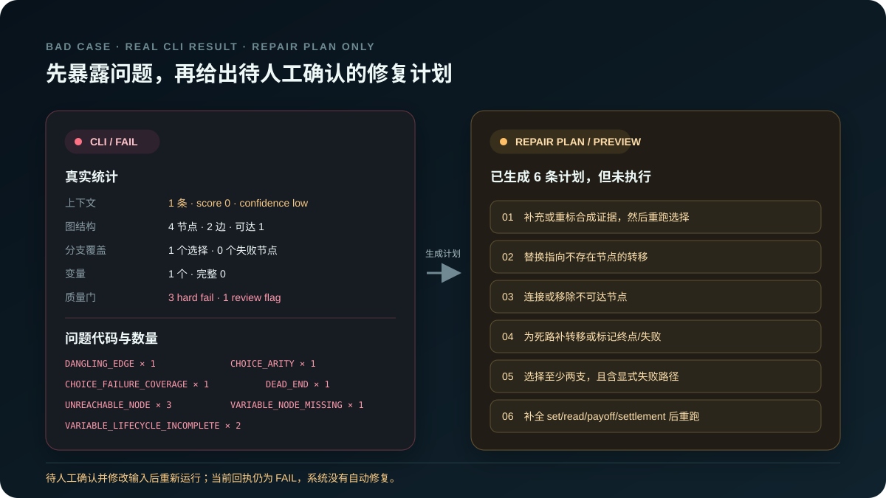

# AI Interactive Story Workflow

> **脱敏重建版 / Privacy-safe reconstruction**  
> 本仓库是使用全新代码与合成数据制作的公开作品集候选。它不包含任何公司或客户名称、真实剧本、内部 Prompt、业务数据、密钥、历史快照、备份或原 Git 历史。

一个仅依赖 Node.js 内置模块的最小工作流演示：

`合成输入 → 上下文选择 → 分支/变量校验 → 质量门 → 自动复审计划 → SHA-256 回执与快照`

## 我的贡献与边界

- 这是我独立完成的 clean-room 作品集重建：由我重新设计产品范围、工作流和数据结构，并使用全新合成数据表达通用能力。
- 我独立实现了 Node.js 核心工作流、校验器、质量门、哈希回执与原生测试，也独立完成静态 Demo 和全部 SVG 说明图。
- 本仓库不代表原公司的生产代码、真实数据、线上系统或业务指标；它只用于展示本人对问题拆解和工程实现的理解。



## 为什么做这个重建版

互动叙事与 Agent 工作流经常同时面临三类问题：上下文来源难追踪、分支/变量容易失配、修复后缺少稳定的回归证据。本项目把这些问题压缩成一个可阅读、可运行、可测试的公开演示，同时把所有示例替换为虚构的「雾灯群岛」合成故事。

## 能力概览

- **轻量上下文选择**：基于关键词与标签的本地检索，保留证据 ID、相关分数和不确定项。
- **分支图校验**：检查悬空边、不可达节点、非终点死路、选择节点分支数与失败覆盖。
- **变量生命周期**：检查 `set → read → payoff → settlement` 是否完整，并校验节点引用与顺序。
- **质量门与复审**：将上下文、图完整性、失败覆盖、变量与可追溯性组织成独立 gate，失败时给出修复计划。
- **可复现回执**：对输入、上下文、校验结果和快照生成 SHA-256 哈希，便于比较回归结果。
- **无外部依赖**：运行时只使用 Node.js 内置模块，不调用在线模型、数据库或云服务。

## 产品原型

直接双击打开 [`demo/index.html`](demo/index.html)，即可切换「正常样例」「注入 Bad Case」「修复计划预览」三种状态。计划预览不会修改输入，也不会伪造修复后的通过结果。



### AVG Demo Editor · 影游 Demo 制作工作台

[`showcase/avg-demo-editor/`](showcase/avg-demo-editor/) 收录一套独立的高保真产品交互原型：用 **14 个可编辑 SVG 画板**覆盖素材导入、改编策略、角色/分支建模、变量触发、Storylet、多人推演、逻辑审校、试玩回放与导出协作。它用于展示复杂 AI 创作产品的信息架构和交互设计，不冒充已上线的商业编辑器。

[查看案例说明](showcase/avg-demo-editor/README.md) · [打开响应式画廊](showcase/avg-demo-editor/index.html)

## 快速开始

要求：Node.js 18 或更高版本。

```bash
npm run check
npm test
npm run example
npm run example:badcase
```

将完整结果写入本地文件：

```bash
node src/cli.js examples/input/synthetic-story.json examples/output/result.local.json
```

`result.local.json` 已被 `.gitignore` 忽略。仓库中提交的 [`examples/output/synthetic-story-result.json`](examples/output/synthetic-story-result.json) 是便于浏览的精简合成输出。

## 数据流

1. 读取带有 `metadata.synthetic=true` 的 JSON；非合成输入会被拒绝。
2. 根据查询从合成 evidence 中选择上下文，并显式保留不确定项。
3. 验证节点、边、可达性、选择失败覆盖与变量生命周期。
4. 聚合质量门；存在失败或复核标记时触发一次策略复审并生成修复计划，但不自动修改输入。
5. 输出 snapshot 与 receipt；回执包含输入、上下文、校验和快照哈希。



详细说明见 [`docs/architecture.md`](docs/architecture.md) 与 [`docs/data-flow.md`](docs/data-flow.md)。

## Bad Case 回归示例

仓库提供一个故意破坏的合成输入，包含悬空边、不可达节点、选择分支数不足、失败分支缺失、死路和变量生命周期缺口。测试会验证这些问题能够被稳定识别并生成可读修复计划；计划需人工确认、修改输入后重新运行。



## 目录结构

```text
src/                  Node.js 工作流、校验、质量门和回执
test/                 Node 原生测试
examples/input/       合成正常样例与合成 Bad Case
examples/output/      精简合成输出
demo/                 可直接本地打开的静态产品原型
docs/                 架构、数据流和 GitHub 可渲染 SVG
showcase/              AVG 影游 Demo 编辑器高保真交互原型
LICENSE               作品集专用保留权利声明
```

## 明确边界

- 本项目不是原项目开源，也不是原仓库的清理副本；代码与示例均为重新设计。
- 不提供或还原任何内部 Prompt，只展示「识别—生成—校验—修复」的高层阶段概念。
- 本地上下文选择是可解释的关键词基线，不等同于生产级向量检索或线上 RAG 服务。
- 自动复审在本演示中输出修复计划，不调用外部 LLM 自动改写内容。
- 修复计划不会自动落盘或改变输入；任何修复结果都必须在人工修改后重新运行验证。
- 未实现登录、多租户、云调度、生产监控或真实用户数据链路。

更多隐私说明见 [`PRIVACY.md`](PRIVACY.md)，安全提交规则见 [`SECURITY.md`](SECURITY.md)。

## 许可

本仓库不是开源软件。详见 [`LICENSE`](LICENSE)：内容仅供作品集评估，未经版权所有者事先书面许可，不得复制、修改、再分发或用于商业用途。

## English overview

This repository is a privacy-safe portfolio reconstruction built from scratch with synthetic data. It demonstrates local context selection, branch and variable validation, quality gates, review planning, and SHA-256 receipts. It contains no proprietary prompts, scripts, story content, customer data, backups, secrets, or original Git history.
