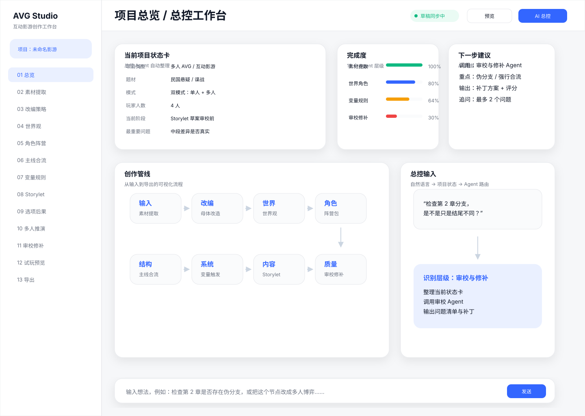
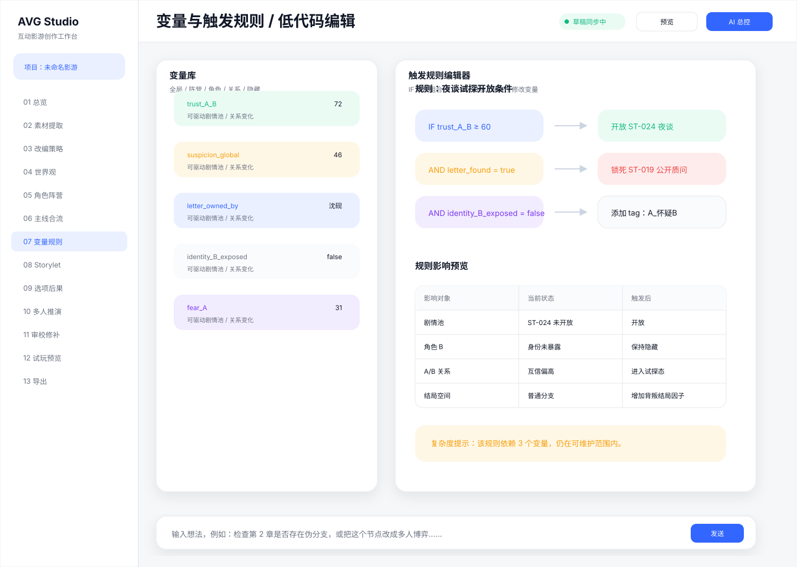
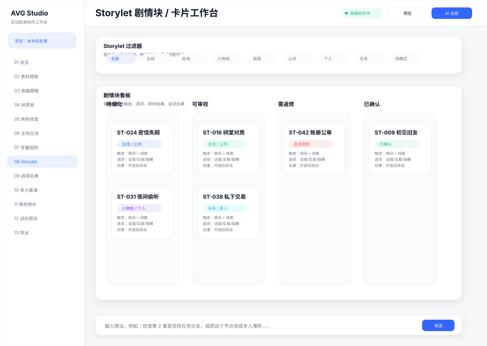
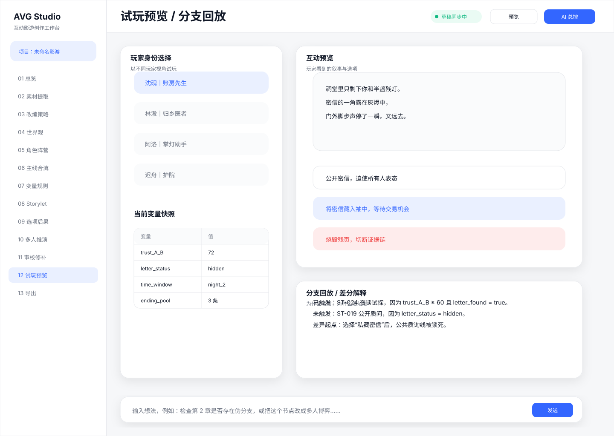

# AVG Demo Editor · 影游 Demo 制作工作台

一套面向互动影游 / AVG 制作流程的高保真产品交互原型。它把“导入素材—建立叙事母体—设计角色与分支—配置变量/触发—组织 Storylet—试玩回放—审校导出”收拢到同一工作台，用 14 个可编辑 SVG 画板描述完整的创作与验收链路。

> 作品边界：这是产品与交互设计原型，用于展示信息架构、复杂创作流程拆解和 AI 辅助产品设计；不是已经上线的商业编辑器，也不包含真实客户素材、内部 Prompt、账号信息或模型密钥。

## 核心设计

- **14 个关键页面**：覆盖总控、素材导入、改编策略、世界观、角色阵营、主线合流、变量触发、Storylet、剧情细化、多人推演、逻辑审校、试玩回放和导出协作。
- **生成式流程可控**：把开放式创作拆为阶段任务、结构化对象和人工确认节点，避免“一次生成到底”。
- **叙事状态可追踪**：以变量、触发条件、分支合流和选项后果承载互动逻辑，支持低代码编辑心智。
- **质量门前置**：在交付前集中检查断链、变量冲突、角色信息差和逻辑缺口，并把试玩回放作为验收环节。
- **矢量可编辑**：单页画板统一为 1440×1024，同时提供 3168×8272 的全套总画板，便于继续修改或复刻为前端原型。

## 流程地图

```text
素材导入 → 改编策略 → 世界观/角色 → 主线与分歧
       → 变量/触发 → Storylet → 选项与后果
       → 多人推演 → 逻辑审校 → 试玩回放 → 导出协作
```

## 在线浏览

下载本目录后打开 [`index.html`](index.html)，即可使用响应式画廊按流程浏览全部页面。GitHub 也可以直接预览 `assets/` 目录中的每个 SVG。

## 代表页面

| 总控工作台 | 变量与触发 | Storylet 工作台 | 试玩回放 |
|---|---|---|---|
|  |  |  |  |

## 文件说明

- `index.html`：无需构建工具的作品集画廊。
- `assets/00…13_*.svg`：14 个独立页面。
- `assets/AVG_全套UI画板_可编辑.svg`：全套纵向总画板。

## 可验证来源

- 原始归档 SHA-256：`706B76397A45A5BCBDDAAEE6DB625CDD855CE17145873C07E218CE343C47EB6B`
- 归档条目：16（1 个目录 + 15 个 SVG）
- 安全检查：未发现脚本、外链、个人联系方式、API Key 或 Token。

